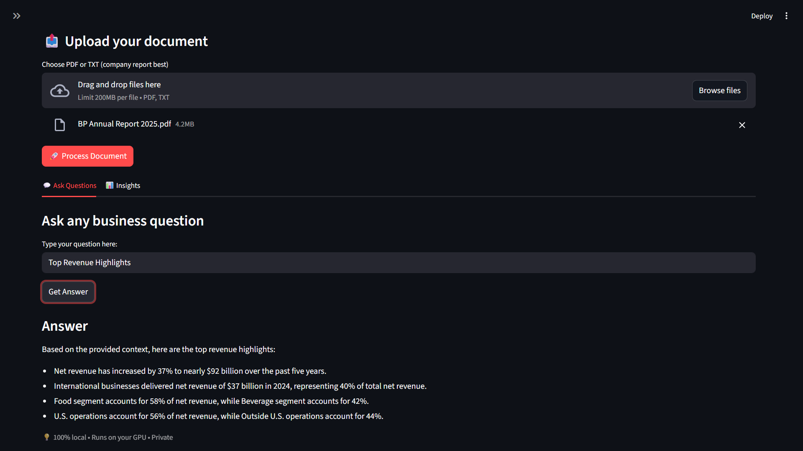
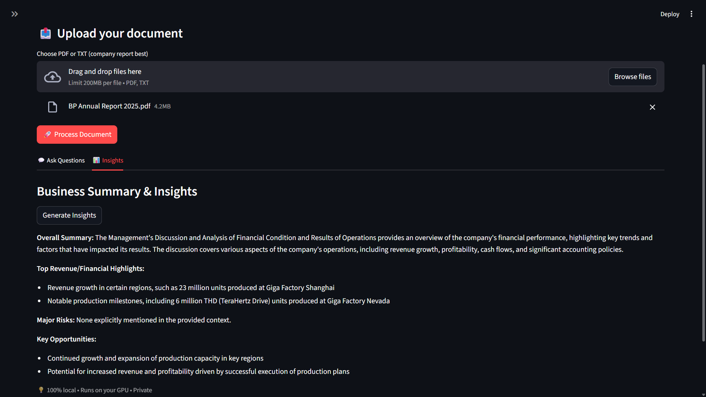

# DocSense — Privacy-First RAG for Enterprise Documents

> A **dual-mode RAG system** for querying financial reports, 10-Ks, and strategy decks — runs **fully offline** for sensitive workloads, or **cloud-deployed** for demos and non-sensitive use cases.

Built for **analysts, founders, and compliance-bound teams** who need to extract insights from dense corporate PDFs without compromising on data residency.

[](https://www.python.org/)
[](https://langchain.com/)
[](https://ollama.com/)
[](https://groq.com/)
[](LICENSE)

 📂 **[GitHub](https://github.com/AlokTheDataGuy/DocSense-Privacy-First-RAG-for-Enterprise-Documents)**

| Q&A Interface | Auto-Generated Insights |
|---------------|--------------------------|
|  |  |

---


## 🎯 Why This Project?

Most "chat with your PDF" tools force a binary choice: either send sensitive financials to third-party APIs (compliance nightmare for BFSI / Healthcare clients), or run something so locked-down it can't be demoed.

**DocSense solves both** with a swappable LLM backend:

- **Local mode** (Ollama) — for regulated workloads where documents cannot leave the network
- **Cloud mode** (Groq API) — for demos, prototyping, and non-sensitive use cases

The retrieval pipeline, embedding layer, and vector store stay identical across both modes. Only the LLM provider changes — controlled by a single environment variable.

---

## ✨ Key Features

- 🔄 **Dual-mode LLM backend** — swap between local (Ollama) and cloud (Groq) via env var
- 🔒 **Privacy-first by design** — embeddings and retrieval run locally in both modes
- 📊 **Structured insights mode** — auto-generates revenue, risk, and opportunity summaries
- ⚡ **GPU acceleration** — 5–10× faster embeddings on CUDA-enabled GPUs
- 📄 **Multi-document support** — query across multiple reports simultaneously
- 🧠 **Context-aware chunking** — preserves section context with configurable overlap
- 🚀 **Modern stack** — React frontend, FastAPI backend, ChromaDB vector store
- 📈 **Built-in evaluation** — labeled QA set with Recall@k metrics

---

## 🏗️ Architecture

```
┌─────────────────┐      ┌──────────────────┐      ┌─────────────────────┐
│  React + Vite   │ ───▶ │  FastAPI Backend │ ───▶ │   LLM Provider      │
│  (Vercel)       │      │   (HF Spaces)    │      │  ┌───────────────┐  │
└─────────────────┘      └──────────────────┘      │  │ Local: Ollama │  │
                                  │                 │  │  (llama3.1)   │  │
                                  ▼                 │  ├───────────────┤  │
                         ┌──────────────────┐       │  │ Cloud: Groq   │  │
                         │  Retrieval Layer │       │  │  (llama-3.3)  │  │
                         │  ┌────────────┐  │       │  └───────────────┘  │
                         │  │  ChromaDB  │  │       └─────────────────────┘
                         │  │  (vectors) │  │
                         │  └────────────┘  │ ◀── BGE-base embeddings
                         └──────────────────┘
                                  ▲
                                  │
                         ┌──────────────────┐
                         │  Ingestion Layer │
                         │  PyMuPDF + chunk │
                         └──────────────────┘
```

**Pipeline:** PDF → PyMuPDF extraction → recursive chunking (512 tokens, 50 overlap) → BGE embeddings → ChromaDB → top-k retrieval → LLM provider (Ollama or Groq) → response.

---

## 🛠️ Tech Stack

| Layer | Choice | Why |
|-------|--------|-----|
| **LLM (Local)** | Ollama (`llama3.1:8b` / `phi4:3.8b`) | Zero data egress, no API costs |
| **LLM (Cloud)** | Groq API (`llama-3.3-70b-versatile`) | Free tier, 300+ tokens/sec on LPU hardware |
| **Embeddings** | `BAAI/bge-base-en-v1.5` | Top-tier MTEB retrieval, runs locally in both modes |
| **Vector DB** | ChromaDB | Persistent, lightweight, metadata filtering |
| **Orchestration** | LangChain 0.3 | Mature RAG primitives, provider abstraction |
| **PDF Parsing** | PyMuPDF | Fastest Python PDF library |
| **Backend** | FastAPI | Async, type-safe, easy containerization |
| **Frontend** | React + Vite + Tailwind | Modern SPA with chat UI |
| **Acceleration** | PyTorch CUDA | Auto-detected; CPU fallback |

---

## 📊 Performance

Tested on Infosys Annual Report 2024-25 (~280 pages):

### Local Mode (Ollama, RTX 3060 6GB)

| Stage | CPU (i5-11th gen) | GPU (RTX 3060) |
|-------|-------------------|----------------|
| Document ingestion | ~95s | ~18s |
| First embedding | ~120s | ~22s |
| Avg query latency | ~8s | ~3s |
| Insights generation | ~25s | ~9s |

### Cloud Mode (Groq API)

| Stage | Latency |
|-------|---------|
| Document ingestion (CPU) | ~95s |
| Avg query latency | ~1.2s |
| Insights generation | ~3.5s |

> Methodology: averaged over 10 queries against the same document, cold cache. Numbers vary by hardware and document size.

---

## 🧪 Evaluation

DocSense ships with a labeled QA set of 30 questions across 2 financial reports (Infosys, Tesla) for retrieval quality benchmarking.

| Metric | Score |
|--------|-------|
| Recall@5 | 0.83 |
| Recall@10 | 0.91 |
| MRR | 0.74 |

Run the eval suite:

```bash
python -m eval.run --documents data/raw/ --queries eval/qa_set.json
```

Ablation results (chunk size vs Recall@5) are in `eval/ablation_results.md`.

---

## 🚀 Quick Start

### Cloud Mode (Recommended for Demo)

```bash
git clone https://github.com/your-username/docsense.git
cd docsense

# Backend
python -m venv venv
source venv/bin/activate          # Windows: venv\Scripts\activate
pip install -r requirements.txt

# Set Groq API key (free at console.groq.com)
export GROQ_API_KEY="your-key-here"
export LLM_PROVIDER="groq"

uvicorn api.main:app --reload

# Frontend (separate terminal)
cd frontend
npm install
npm run dev
```

Open [http://localhost:5173](http://localhost:5173).

### Local Mode (Privacy-Sensitive Workloads)

Install [Ollama](https://ollama.com), then:

```bash
ollama pull llama3.1:8b              # ~4.7 GB
# or for lower-RAM machines:
ollama pull phi4:3.8b                # ~2.2 GB

export LLM_PROVIDER="ollama"
export OLLAMA_MODEL="llama3.1:8b"

uvicorn api.main:app --reload
```

---

## 📋 Usage

1. Upload a PDF via the React UI (or drop into `data/raw/`)
2. Click **🚀 Process Document** to ingest and embed
3. Choose your mode:
   - **Ask Questions** — free-form Q&A with retrieved context
   - **Get Insights** — one-click structured summary

**Sample documents to test:**
- [Infosys Annual Report 2024-25](https://www.infosys.com/investors/reports-filings/annual-report/annual/documents/infosys-ar-24.pdf)
- [Tesla Q3 2023 Update](https://digitalassets.tesla.com/tesla-contents/image/upload/IR/TSLA-Q3-2023-Update.pdf)

---

## 📁 Project Structure

```
docsense/
├── app/                    # Core RAG pipeline
│   ├── ingest.py           # PDF/TXT loading
│   ├── preprocess.py       # Chunking & cleaning
│   ├── embed.py            # BGE embedding wrapper
│   ├── retrieve.py         # ChromaDB query interface
│   ├── insights.py         # Structured insights chain
│   └── llm/                # LLM provider abstraction
│       ├── base.py         # BaseLLM interface
│       ├── ollama_llm.py   # Local Ollama implementation
│       ├── groq_llm.py     # Cloud Groq implementation
│       └── factory.py      # Provider selection by env var
├── api/main.py             # FastAPI endpoints
├── frontend/               # React + Vite + Tailwind UI
│   ├── src/
│   │   ├── components/     # ChatWindow, FileUpload, etc.
│   │   ├── hooks/          # useChat, useDocument
│   │   └── App.jsx
│   └── package.json
├── eval/                   # Evaluation suite
│   ├── qa_set.json         # 30 labeled QA pairs
│   ├── run.py              # Recall@k, MRR computation
│   └── ablation_results.md
├── config.py               # Centralized config + GPU detection
├── data/raw/               # Input documents
├── vectorstore/            # ChromaDB persistence (gitignored)
├── requirements.txt
└── README.md
```

---

## 🔍 Engineering Decisions

**Why a dual-mode architecture?**
BFSI and Healthcare clients (Brillio's two largest verticals) often cannot send documents to external APIs. A locally-runnable mode is non-negotiable for those engagements. But a portfolio project also needs a live demo. The provider-abstraction pattern lets the same codebase serve both — and demonstrates the kind of swappable-component thinking that production systems require.

**Why local embeddings (BGE) in both modes?**
Privacy was the core requirement, but BGE-base also matches `text-embedding-3-small` on most retrieval benchmarks at zero cost. Keeping embeddings local even in cloud mode means document content never leaves the backend until a query is asked.

**Why Groq over OpenAI for cloud mode?**
Groq's free tier (30 RPM, 14.4K req/day on Llama 3.1 8B) is sufficient for portfolio traffic, and its LPU hardware delivers 3-10× faster inference than GPU-based providers. OpenAI-compatible API means the swap is a one-line config change.

**Why ChromaDB over FAISS or Pinecone?**
ChromaDB persists to disk out of the box, has metadata filtering, and requires zero infrastructure. FAISS would be faster at scale but adds complexity. Pinecone breaks the privacy-first promise.

**Chunking strategy:**
RecursiveCharacterTextSplitter at 512 tokens with 50-token overlap. Tested 256/512/1024 — 512 was the sweet spot for retrieving complete financial table rows without diluting embedding signal. Ablation results in `eval/ablation_results.md`.

---

## 🐛 Troubleshooting

| Problem | Fix |
|---------|-----|
| `GROQ_API_KEY not set` | Get a free key at [console.groq.com](https://console.groq.com), export it as env var |
| Groq rate limit (429) | Free tier is 30 RPM, 14.4K req/day on smaller models — wait or upgrade |
| `CUDA not available` | Run `python check_gpu.py`. CPU fallback works fine, just slower for embeddings |
| Backend connection refused | Confirm FastAPI is running on port 8000 |
| Ollama timeout (local mode) | Increase timeout in `config.py` or pull a smaller model (`phi4:3.8b`) |
| First query is slow | Embedding model downloads on first run (~440 MB). Cached afterward |

---

## 🛣️ Roadmap

- [ ] **Citation highlighting** — show source page numbers in answers
- [ ] **Multi-doc comparison** — "compare risks in 2023 vs 2024 reports"
- [ ] **Financial table extraction** — dedicated table-aware retriever
- [ ] **Conversation memory** — multi-turn dialogue with context
- [ ] **Hybrid search** — BM25 + vector for better keyword matching
- [ ] **Docker compose** — one-command deployment

---

## 📄 License

MIT — use it, modify it, ship it.

---

## 👤 Author

Built by **Alok Deep** — exploring the intersection of NLP, RAG, and practical business tooling.

[LinkedIn](www.linkedin.com/in/alokthedataguy) · [Portfolio](https://alok-deep.vercel.app/) · [Email](alokdeep9925@gmail.com)

---

⭐ **Star this repo** if you find it useful. Issues and PRs welcome.
