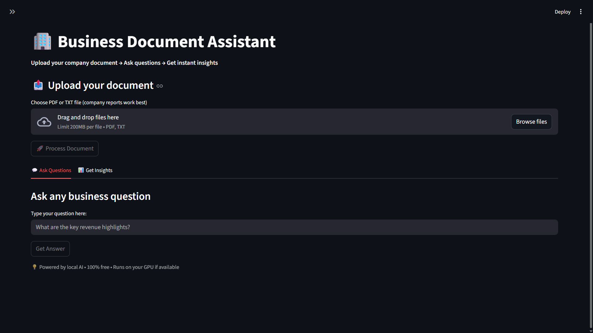

# 🏢 Business Document Assistant

**A 100% free, local & private AI RAG system** that answers questions and generates business insights from your company documents (PDFs & TXT).

Built for **business analysts, founders, and teams** who want to chat with annual reports, financial statements, strategy decks, etc. — without sending data to any cloud.

---

## 📸 Screenshot



---

## ✨ Features

- **Upload & Process** company PDFs/TXT instantly
- **Smart Q&A** — ask anything about your documents
- **Auto Insights** — one-click summary + key points (revenue, risks, opportunities)
- **GPU Accelerated** — 5–10x faster on NVIDIA GPUs
- **Fully Local & Private** — nothing leaves your laptop
- **Beginner-friendly UI** with clear error messages
- **Single or multiple documents** supported

---

## 🛠️ Tech Stack (All Free & Open Source)

| Component      | Tool                           |
|----------------|--------------------------------|
| Framework      | LangChain + ChromaDB           |
| Embeddings     | BAAI/bge-base-en-v1.5          |
| LLM            | Ollama (llama3.3:8b or phi4)   |
| Backend        | FastAPI                        |
| Frontend       | Streamlit                      |
| PDF Extraction | PyMuPDF                        |
| GPU Support    | PyTorch CUDA                   |

---

## 📁 Project Structure

```
rag-system/
├── data/raw/              # ← Drop your PDFs/TXT here
├── vectorstore/           # Auto-created (ChromaDB index)
├── app/                   # Core logic
│   ├── ingest.py
│   ├── preprocess.py
│   ├── embed.py
│   ├── retrieve.py
│   ├── generate.py
│   └── insights.py
├── api/main.py            # FastAPI backend
├── ui/app.py              # Streamlit UI
├── config.py              # Settings + GPU auto-detect
├── check_gpu.py           # Test your GPU
├── requirements.txt
├── .gitignore
├── screenshot.png         # ← Add your UI screenshot here
└── README.md
```

---

## 🚀 Quick Start (5 minutes)

### 1. Install Ollama (LLM)

- Download from [ollama.com](https://ollama.com)
- Run in terminal:

```bash
ollama pull llama3.3:8b
```

> Or `ollama pull phi4:3.8b` if your laptop is lighter.

### 2. Setup Project

```bash
# 1. Clone or go to your project folder
cd rag-system

# 2. Create virtual environment
python -m venv venv

# Windows:
venv\Scripts\activate

# Linux/Mac:
source venv/bin/activate

# 3. Install requirements
pip install -r requirements.txt

# 4. Check GPU (optional but recommended)
python check_gpu.py
```

### 3. Run the App

**Terminal 1 — Start FastAPI backend:**

```bash
uvicorn api.main:app --reload
```

**Terminal 2 — Start Streamlit UI:**

```bash
streamlit run ui/app.py
```

Open browser → [http://localhost:8501](http://localhost:8501)

---

## 📋 How to Use

1. Upload your company document (Annual Report, Financial Statement, Business Plan, etc.)
2. Click 🚀 **Process Document**
3. Go to **Ask Questions** tab → type your question
4. Or go to **Get Insights** tab → click **Generate Insights**

**Accepted files:**

- PDF or TXT (company/enterprise documents only)
- Best results with annual reports, quarterly updates, strategy decks
- Files > 500 pages will take longer

---

## 🧪 Test with Sample Data

Download these free public reports and drop them in `data/raw/`:

- [Infosys AR 2024-25](https://www.infosys.com/investors/reports-filings/annual-report/annual/documents/infosys-ar-24.pdf)
- [Tesla Q3 2023 Update](https://digitalassets.tesla.com/tesla-contents/image/upload/IR/TSLA-Q3-2023-Update.pdf)

---

## 🔧 Troubleshooting

| Problem | Fix |
|---|---|
| GPU not detected | Run `python check_gpu.py` |
| Embedding slow | Make sure Ollama and NVIDIA drivers are installed |
| `CUDA not available` error | You can still run on CPU (just slower) |
| Backend not connecting | Keep the FastAPI terminal running |
| First embedding takes time | Only happens once — next time is fast |

---

## 🎯 Future Improvements

- [ ] Conversation memory
- [ ] Export answers as PDF
- [ ] Support for more document types
- [ ] Parent-document retriever for very large PDFs

---

## 📄 License

MIT License — feel free to use, modify, and share.

---

Made with ❤️ for business users who want privacy + speed.

⭐ Star this repo if it helped you! Questions? Just open an issue.

Happy analyzing! 🚀
